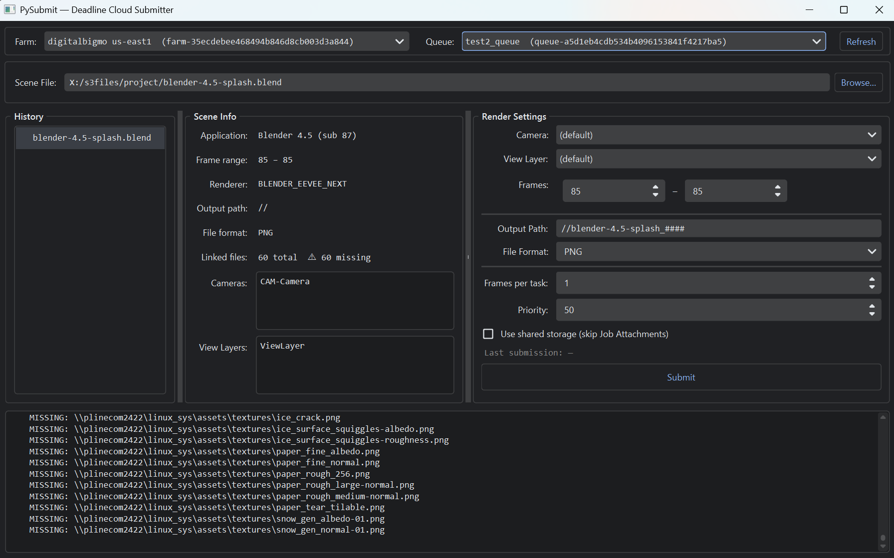

# PyDeadlineCloudSubmitter

[](./LICENSE)
[](https://www.python.org/downloads/)

Blender / NukeX のレンダリングジョブを **AWS Deadline Cloud** に投げるための、シンプルな PySide6 製 GUI サブミッターです。

- `.blend` / `.nk` をドロップ → カメラ・ビューレイヤー・Write ノード等を選択 → そのまま Submit
- 外部参照ファイル（リンク .blend、テクスチャ、Read シーケンス等）は自動収集して Job Attachments で同梱
- Blender / Nuke 本体への依存なし（純 Python パーサで `.blend` / `.nk` を解析）



---

## クイックスタート（5分で試す）

```bash
# 1. 仮想環境を用意（Python 3.12+）
python -m venv .venv
.venv\Scripts\activate

# 2. 依存をインストール
pip install -r requirements.txt

# 3. AWS 認証を済ませておく（後述）— Deadline Cloud Monitor を使っているなら自動で OK
# 4. GUI 起動
python gui.py
```

GUI 起動後の操作:

1. 上部の **Farm / Queue** を選ぶ（初回は Refresh をクリック）
2. **Scene File** に `.blend` または `.nk` をドロップ（または Browse...）
3. 右ペインで **フレーム範囲 / カメラ / 出力先** などを調整
4. **Submit** を押す

ジョブが投入されたら、Deadline Cloud Monitor やコンソールで進行を確認できます。

---

## 動作要件

| 項目 | バージョン / 備考 |
|---|---|
| Python | **3.12 以上**（boto3 が 3.11 以下のサポートを切ったため） |
| OS | サブミッター: Windows / macOS / Linux のいずれでも可。ワーカー側は **Linux fleet** 想定（テンプレ内のシェルが bash） |
| GUI | PySide6 ≥ 6.4（`QFormLayout.setRowVisible` を使うため） |
| AWS | Deadline Cloud Farm / Queue / Fleet が構築済みであること |

依存パッケージは [`requirements.txt`](requirements.txt) を参照:

- `deadline`（AWS Deadline Cloud client。`boto3` / `botocore` を間接的に取り込み）
- `PySide6`（GUI）
- `pyqtdarktheme`（ダークテーマ。なくてもフォールバック動作）
- `PyYAML`（`asset_references.yaml` 生成）
- `zstandard`（Zstd 圧縮された新しい `.blend` を読むため）

---

## 認証（AWS Credentials）

本ツールは **独自のログイン UI を持ちません**。boto3 のデフォルトのクレデンシャルチェーン（環境変数 → `~/.aws/credentials` → `~/.aws/config` プロファイル → SSO キャッシュ → コンテナ / EC2 メタデータ）に従って解決します。代表的な構成:

| 環境 | 推奨セットアップ |
|---|---|
| Windows + Deadline Cloud Monitor | DCM がプロファイルを書いてくれるので、追加設定なしで動くことが多い |
| EC2 上の Linux | IAM インスタンスプロファイルを付与（`AWSDeadlineCloudUserAccessFarms` / `Queues` / `Jobs` 相当） |
| その他 | `aws sso login --profile <name>` などを事前に実行し、`AWS_PROFILE` を設定 |

起動時に GUI 下部のログへ `sts:GetCallerIdentity` の結果が出るので、想定どおりの IAM プリンシパルでログインしているかをまず確認してください。リージョン未設定時は `us-east-1` にフォールバックします。

---

## アーキテクチャ概要

| ファイル | 役割 |
|---|---|
| [`gui.py`](gui.py) | PySide6 GUI 本体。シーンタイプに応じてパーサ／テンプレを振り分け、Submit までを担当 |
| [`main.py`](main.py) | デバッグ用の最小 CLI エントリ |
| [`blendfile.py`](blendfile.py) | `.blend` の純 Python パーサ。シーン情報＋外部参照（Library / Image / Sound 等）を再帰収集 |
| [`nukescript.py`](nukescript.py) | `.nk` の純 Python パーサ。Root / Write ノード解析＋Read シーケンス（`%04d` / `####`）の glob 展開 |
| [`template_blender.yaml`](template_blender.yaml) | Blender 用 OpenJD `jobtemplate-2023-09` |
| [`template_nuke.yaml`](template_nuke.yaml) | NukeX 用 OpenJD `jobtemplate-2023-09` |
| [`nuke_init.py`](nuke_init.py) | ワーカー側 Nuke の `init.py`。Read のパスマッピング＋Write の出力先リダイレクトを担当 |

提出ごとに `tempfile.mkdtemp()` で **使い捨ての Job Bundle** を生成し、テンプレと `asset_references.yaml` をその中に書き出してから `create_job_from_job_bundle()` を呼びます。プロジェクト本体のファイルがそのまま Job Attachments に含まれることはありません。

GUI レイアウト:

```
+-------------------------------------------------------+
| Farm: [...▼]   Queue: [...▼]              [Refresh]   |
| Scene File: [path]                       [Browse...]  |
+----------+----------------+--------------------------+
| History  | Scene Info     | Render Settings          |
| (queue)  | (read-only)    | (editable, per-entry)    |
|          |                | [   Submit   ] [Progress]|
+----------+----------------+--------------------------+
| Log                                                   |
+-------------------------------------------------------+
```

---

## ジョブ設定（per-entry）

`History` に並ぶ各エントリは独立した設定を保持します（同じファイルを別パラメータで複数回投げられます）。

### 共通

- フレーム範囲（Start / End）
- Frames per Task（チャンクサイズ）
- Farm / Queue / Priority

### Blender 固有

- **Camera** — 空 = シーン既定。指定時は `--python-expr` で `scene.camera` を上書き
- **View Layer** — 空 = 全レイヤー。指定時はそのレイヤーのみ有効化
- **Output Format** — `bpy.types.ImageFormatSettings.file_format` の enum 識別子（`PNG` / `OPEN_EXR` 等）
- **Output Path** — Blender の pic 値（`//CAM-A/Layer1/splash_####` 等）。カメラ／レイヤー変更時に自動更新

実行時はテンプレ内の bash が `OutputPath` の `//` プレフィックスを剥がして `OutputDir` 配下に再ルーティングし、`blender -b ... --enable-autoexec ... -a` を叩きます。`--enable-autoexec` は PyDriver / アドオン依存のシーン（Blender Studio splash 等）で必須です。

### Nuke 固有

- **Write Node** — 空 = 有効な Write すべて。指定時は `-X <name>` で対象を絞る
- **Views** — カンマ区切り。空 = スクリプト既定。`--view <list>` として渡る

実行時の挙動:

1. ワーカーが `nuke_init.py` を `init.py` として `NUKE_PATH` に配置
2. 起動後 `addOnScriptLoad` コールバックで:
   - **Read 系ノード**（Read / DeepRead / ReadGeo* / Camera* / Axis* / Light / OCIOFileTransform / AudioRead / Vectorfield）の `file` knob を、Deadline のパスマッピングルール（`DEADLINE_PATH_MAPPING_RULES_FILE` 等）でワーカー側パスに書き換え
   - **Write ノード**の `file` knob を `<OutputDir>/<WriteName>/<basename>` にリダイレクト
3. `nuke --nukex -x -F "$START-$END" [-X $WriteNode] [--view $Views] "$SCENE_FILE"` を実行

ユーザーの `.nk` 自体は一切編集されず、Nuke のメモリ上でのみ書き換わります。

---

## 既知の制限・ハマりどころ

- **TASK_CHUNKING はテンプレ上は宣言済みだが、現状のファームでは効かない** — 1 フレーム = 1 タスクになる挙動。ファーム側の修正待ちですが、テンプレ側の宣言は将来に備えて残してあります。
- **Deadline Cloud Monitor 同梱 CLI 0.52.1 にダウンロード不具合あり** — 出力ファイルが存在しても "no output files available" を返す。Monitor を 0.55.1+ に更新するか、venv の CLI を直接使う（`.venv\Scripts\deadline.exe job download-output ...`）。
- **Blender に `--scene-camera` フラグは無い**（古いドキュメントの誤り）。本ツールは `--python-expr` で `scene.camera = ...` を実行して切り替えています。
- **Nuke の Read シーケンス展開は glob ベース** — `%04d` / `####` を含むパスは親ディレクトリ列挙＋正規表現で解決します。同パターンに該当する無関係ファイルがあると一緒にアップロードされます。Tcl / Python 式（`[python ...]`、`[getenv ...]`）や `$ENV` を含むパスは静的に解決できないため、欠損として記録されます。
- **ワーカー RAM の枯渇に注意** — Blender Studio の大規模シーン（`gold-splash_screen.blend` 等）はピーク 12GB 超になることがあり、フリート構成によっては OOM-kill されます。

---

## 開発

- テストスイート / リント設定は **無し**（個人プロジェクトのため）
- 詳細な内部仕様や設計判断は [`CLAUDE.md`](CLAUDE.md) に集約されています

---

## ライセンス

MIT License の下で公開されています。詳細は [LICENSE](./LICENSE) を参照してください。
